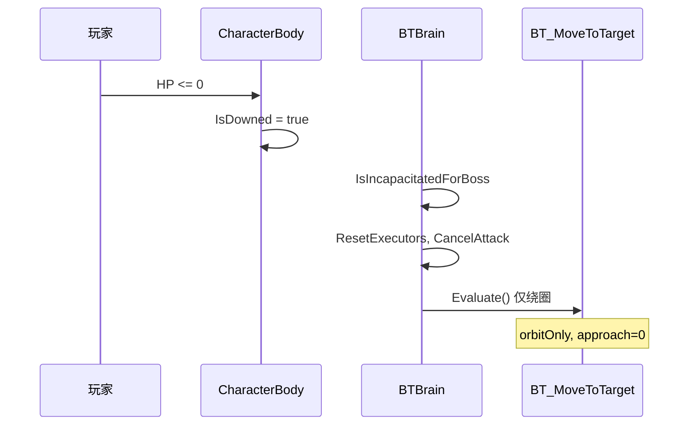
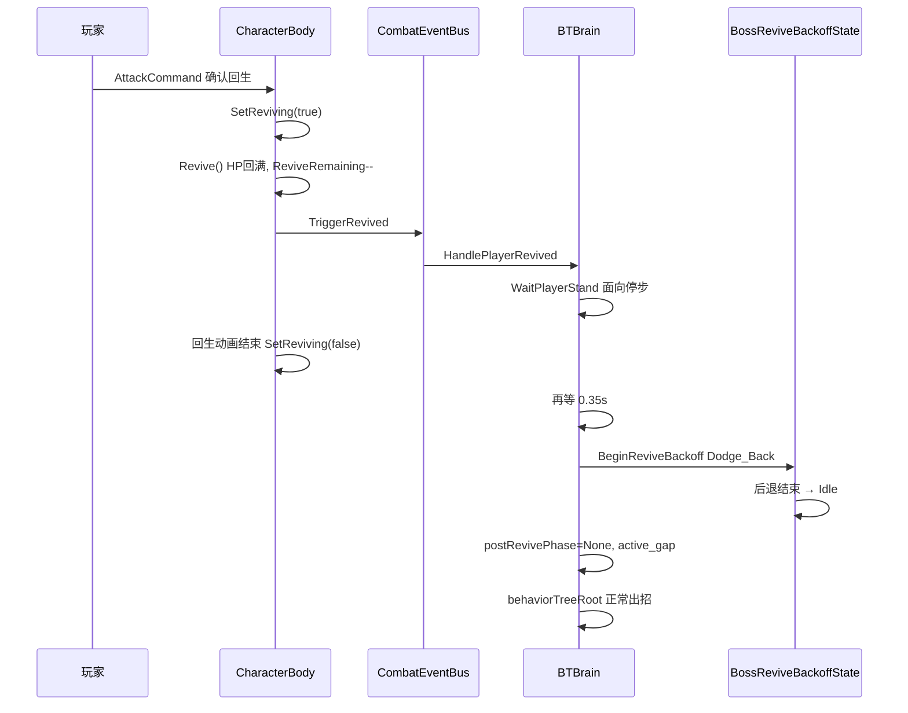

# Boss 死亡绕圈与复活礼节

日期：2026-08-29  
状态：已实现（待 Unity 手测验收）  
依据：`Docs/architecture/04-behavior-tree-ai.md`、`Docs/architecture/02-combat-data.md`、`Docs/architecture/06-presentation.md`

## 1. 需求摘要

| # | 需求 | 预期表现 |
|---|------|----------|
| 1 | 玩家死亡后 Boss 绕圈 | 单侧绕玩家转圈，不周期性换边导致「来回走」；不出主动招 |
| 2 | 复活点 UI | 死亡时不扣点；玩家确认「起死回生」并真正复活后才扣 1 点 |
| 3 | 复活后 Boss 礼节 | 等玩家起身 → 垫步后退 → 再进入正常 AI 出招 |
| 4 | 暂停根页文案 | 「退出战斗」改为「重新开始」（重开当前场景） |

被动格挡/弹反（`TryPassiveDeflect`）不受本改动影响，玩家攻击 Boss 时仍会触发。

## 2. 设计原则

### 2.1 玩家失能判定

Boss AI 统一使用 `CharacterBody.IsIncapacitatedForBoss`：

```csharp
public bool IsDowned => CurrentHP <= 0;
public bool IsReviving { get; private set; }
public bool IsIncapacitatedForBoss => IsDowned || IsReviving;
```

- **IsDowned**：HP 归零，躺在地上等待回生选项或真死。
- **IsReviving**：已调用 `Revive()` 回满血，但回生爬起动画尚未播完。
- 行为树各出招节点（`BT_PickActive` / `BT_Kengeki` / `BT_HealPunish`）在目标失能时返回 `Failure`，不主动攻击。

### 2.2 BTBrain 三层分流

`BTBrain.Update()` 按优先级短路，避免失能/复活期间行为树落到出招节点：

```
每帧 Update
  ├─ 忍杀锁定 / 被弹硬直 → 清执行器，return
  ├─ postRevivePhase != None → 复活礼节状态机，return
  ├─ 玩家失能 (IsIncapacitatedForBoss) → 只跑 BT_MoveToTarget，return
  ├─ 开场语音 IsOpeningHold → 只走位不出招，return
  └─ behaviorTreeRoot.Evaluate() → 正常 AI
```

**注意**：`if (IsOpeningHold())` 必须与注释分行书写。若与 `//` 写在同一行，整行 `if` 会被注释掉，裸 `{ return; }` 块会每帧执行，导致 Boss 永远不出招（仅被动防御）。

### 2.3 死亡绕圈（BT_MoveToTarget）

玩家失能且进入攻击距离内时：

- `approach = 0`：只绕圈，不朝尸体/起身中的玩家逼近。
- `orbitOnly = true`：锁定绕圈方向（`downedOrbitSign`），不再按 `roamStrafeDuration` 周期性换边，避免观感上的「来回走」。

### 2.4 复活礼节（PostRevivePhase）

订阅 `CombatEventBus.OnRevived`，在玩家调用 `Revive()` 时切入：

| 阶段 | 行为 | 退出条件 |
|------|------|----------|
| `WaitPlayerStand` | 面向玩家、停步 | `IsReviving == false` 后再等 `0.35s` |
| `DodgeBack` | 切入 `BossReviveBackoffState`，播 `Dodge_Back` | 动画结束或 `0.6s` 兜底 |
| `None` | 正常 AI；写入 `active_gap` 冷却，避免立刻连招 | — |

### 2.5 复活点 UI

| 事件 | 旧行为 | 新行为 |
|------|--------|--------|
| `OnReviveAvailable`（死亡、有回生次数） | UI 立刻 `ReviveRemaining - 1` | **不扣点**，只显示回生提示 |
| `OnRevived`（确认回生） | 隐藏提示 | `SetReviveDots(ReviveRemaining)`（此时 `Revive()` 已扣 1） |
| `OnDeath`（真死 / 放弃回生） | 强制显示 0 点 | 显示实际 `ReviveRemaining`（通常为 0） |

数值扣减仍在 `CharacterBody.Revive()` 内：`ReviveRemaining--`，UI 只反映结果，不提前消费。

### 2.6 暂停菜单

- 根页按钮文案：**重新开始**（逻辑仍为 `RestartScene`）。
- `TryBindExisting` 兼容旧场景里名为「退出战斗」的按钮，运行时把 TMP 文本改为「重新开始」。

## 3. 涉及文件

| 文件 | 改动 |
|------|------|
| `Assets/Scripts/FrameWork/Body/CharacterBody.cs` | `IsReviving`、`IsIncapacitatedForBoss`、`SetReviving()` |
| `Assets/Scripts/FrameWork/States/Dead/RevivePendingState.cs` | `BeginRevive()` 设 `IsReviving=true`；起身完成 / `OnExit` 清 false |
| `Assets/Scripts/Boss/BTBrain.cs` | 失能绕圈短路、复活礼节状态机、`OnRevived` 订阅 |
| `Assets/Scripts/Boss/BossReviveBackoffState.cs` | 新建：复活后垫步后退 |
| `Assets/Scripts/Boss/BehaviourTree/BT/BT_MoveToTarget.cs` | 失能绕圈、方向锁定 |
| `Assets/Scripts/Boss/BehaviourTree/BT/BT_PickActive.cs` | `IsDowned` → `IsIncapacitatedForBoss` |
| `Assets/Scripts/Boss/BehaviourTree/BT/BT_Kengeki.cs` | 同上 |
| `Assets/Scripts/Boss/BehaviourTree/BT/BT_HealPunish.cs` | 同上 |
| `Assets/Scripts/UI/CombatUIController.cs` | 死亡不扣复活点 UI |
| `Assets/Scripts/UI/PauseMenuController.cs` | 「重新开始」文案与兼容绑定 |

## 4. 流程图

### 4.1 玩家死亡 → Boss 绕圈



### 4.2 玩家复活 → Boss 礼节



## 5. 验收清单

在 Unity Play 模式中逐条验证：

| # | 操作 | 预期 |
|---|------|------|
| 1 | 正常开战，开场语音结束后 | Boss **主动出招**（不只被动格挡） |
| 2 | 被 Boss 打死，仍有复活次数 | Boss **单侧绕圈**，不左右来回；**不出招** |
| 3 | 同上，观察复活点 UI | 死亡后点数**不变** |
| 4 | 选择「起死回生」 | 点数 **减 1**；Boss **停步面向**玩家 |
| 5 | 玩家起身动画结束 | Boss **垫步后退**，再恢复主动 AI |
| 6 | 复活次数用尽真死 | UI 显示 **0** 点 |
| 7 | 战斗中暂停 → 根页 | 按钮为「**重新开始**」，点击重开场景 |

## 6. 已知问题与修复记录

### 6.1 Boss 只会防御（已修复）

**现象**：改动后 Boss 从不主动出招，玩家攻击时仍被动格挡。

**根因**：`BTBrain.cs` 中注释与 `if (IsOpeningHold())` 合并到同一行，`if` 被注释掉，后续裸代码块每帧 `return`，`behaviorTreeRoot.Evaluate()` 永不执行。

**修复**：注释与 `if` 分行；仅 `IsOpeningHold == true` 时短路走位。

### 6.2 修改时注意

- 编辑 `BTBrain.Update()` 时，**禁止**把 `if` 与行尾注释写在同一行。
- `postRevivePhase` 与 `IsIncapacitatedForBoss` 职责分离：前者管复活礼节，后者管死亡绕圈与出招节点拒收。
- 复活点 UI 与 `ReviveRemaining` 扣减时机保持一致：**只在 `Revive()` 成功后**更新显示。

## 7. 相关架构文档

- 行为树 / Boss AI：`Docs/architecture/04-behavior-tree-ai.md`
- 复活 / 架势 / 属性：`Docs/architecture/02-combat-data.md`
- UI / 暂停菜单：`Docs/architecture/06-presentation.md`
