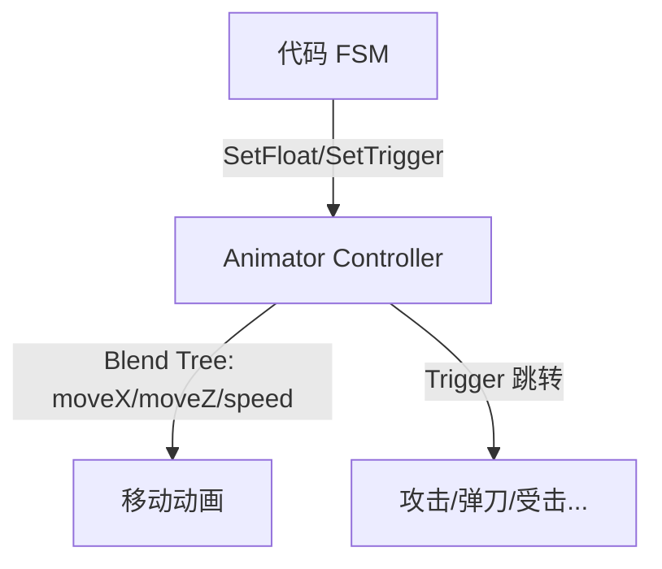

# 技术选型与架构决策

> 本文档记录本项目（复刻只狼战斗系统）的技术选型、架构决策及其理由。
> 新功能实现前应先阅读本文档，确保风格一致。

---

## 一、项目基础

| 项目 | 选型 | 理由 |
|------|------|------|
| Unity 版本 | **2022.3 LTS** | 长期支持版，稳定 |
| 渲染管线 | **URP 14.x** | 性能好，移动/PC 通用 |
| 语言 | **C# 9.0+** | Unity 2022 默认 |
| 脚本后端 | **Mono / IL2CPP** | 默认，发布时切 IL2CPP |

---

## 二、架构决策

### 2.1 不使用 asmdef（程序集定义）

**决策：** 所有脚本放在默认 `Assembly-CSharp` 中，不创建任何 `.asmdef` 文件。

**理由：**
- 项目规模不大，不需要程序集隔离带来的编译优化
- asmdef 增加了依赖管理的复杂性（循环引用、引用方向必须显式声明）
- 跨程序集引用 `internal` 成员会出问题，统一程序集避免此类麻烦

**注意：** Unity Package 自带的 asmdef（如 Input System、UGUI 等）不受影响。

### 2.2 不使用命名空间

**决策：** 所有类在全局命名空间中定义。

**理由：**
- 项目代码量不大，类名冲突概率低
- 避免 `using X.Y.Z` 的冗余写法
- 简化重构时的迁移成本

**约束：** 类名必须足够明确（如 `PlayerStateMachine`、`BossAttackState`），避免歧义。

### 2.3 模块间解耦：事件总线

**决策：** 使用 `CombatEvents` 静态事件总线进行模块通信。

**规则：**
- `Player/` 和 `Boss/` 目录下的类**禁止直接引用对方模块**
- 所有跨模块交互通过 `CombatEvents.RaiseXxx()` 发布事件
- 模块内部通过 `CombatEvents.SubscribeOnXxx()` 订阅

**事件列表：** `OnPlayerDamaged`、`OnBossDamaged`、`OnPerfectDeflect`、`OnBossPostureBreak`、`OnDangerWarning` 等（详见 `CombatEvents.cs`）。

### 2.4 动画检测：OverlapSphere

**决策：** 弹刀/攻击命中判定使用 `Physics.OverlapSphere` 每帧检测。

**理由：**
- `OnTriggerEnter` 在动画事件时间轴上不够精确
- OverlapSphere 可在攻击判定帧精确控制检测范围和时间点
- 配合 HitStop 实现刀刀到肉的帧冻结效果

### 2.5 数据配置：ScriptableObject

**决策：** 所有可变战斗参数使用 `ScriptableObject` 资产文件，禁止硬编码。

**适用范围：**
| 资产 | 内容 |
|------|------|
| `PlayerStats` | 玩家血量、架势、躯干值等 |
| `BossStats` | Boss 血量、架势、躯干值等 |
| `DeflectConfig` | 弹刀判定窗口、完美弹刀阈值 |
| `CombatConfig` | 伤害系数、架势伤害系数 |
| `BossAttackData` | Boss 各招式的伤害、前摇/判定/后摇时长 |

---

## 三、状态机架构

### 3.1 本质：FSM（有限状态机）
**结论：** 本项目本质上是带优先级系统的 **FSM*

- 所有状态在同一层（没有状态嵌套状态）
- 唯一接近 HFSM 的是"优先级打断"机制，但这只是状态的打断规则，不是层级嵌套
- 基类 `State` + `StateMachine` 是多态的常规 FSM 写法

**术语澄清：**
| 说法 | 正确性 | 说明 |
|------|--------|------|
| "FSM 用基类+多态" | ✅ | 每个状态一个类，这是标准 FSM |
| "带优先级的 FSM" | ✅ | 准确描述 |

### 3.2 状态机结构

```
Core/StateMachine/
├── State.cs              ← 抽象基类：Enter/Execute/Exit
└── StateMachine.cs       ← 容器：AddState/TransitionTo/Update

Player/StateMachine/
├── PlayerStateMachine.cs  ← 状态机 + Context 结构体 + TryTransitionTo(优先级检查)
├── PlayerStateMachineDriver.cs  ← MonoBehaviour 驱动层
├── GroundedState.cs       ← 优先级 0（基础层）
├── AirborneState.cs       ← 优先级 0
├── AttackState.cs         ← 优先级 1
├── MikiriState.cs         ← 优先级 2
├── DodgeState.cs          ← 优先级 3
├── DeflectState.cs        ← 优先级 4
├── HealState.cs           ← 优先级 5
├── HitState.cs            ← 优先级 7
├── StunState.cs           ← 优先级 8
└── DeathblowState.cs      ← 优先级 9

Boss/
├── BossStateMachine.cs    ← 状态机 + Context
└── States/
    ├── BossIdleState.cs
    ├── BossMoveState.cs
    ├── BossAttackState.cs
    ├── BossStaggerState.cs
    ├── BossCollapseState.cs
    └── BossExecutedState.cs
```

### 3.3 优先级打断规则

```
Deathblow(9) > Stun(8) > Hit(7) > Heal(5) > Deflect(4)
> Dodge(3) > Mikiri(2) > Attack(1) > Grounded/Airborne(0)
```

- 高优先级可打断低优先级
- 相同优先级**不能互相打断**
- 非战斗状态（Grounded/Airborne）优先级最低，任何战斗状态都可打断

---

## 四、输入系统

### 4.1 Unity 新 Input System

**决策：** 使用 Unity Input System 包 + `.inputactions` 资产文件。

**资产文件：** `Assets/Resources/Input/PlayerInputActions.inputactions`

**结构：**
- `Gameplay` ActionMap，包含 8 个 Action
- 支持键鼠 + 手柄双绑定
- 运行时通过 `Resources.Load` 加载

**读取组件：** `InputReaderComponent`（挂载在玩家 GameObject 上）

**各 Action 对应关系：**
| Action | 键鼠绑定 | 手柄绑定 | 读取方式 |
|--------|---------|---------|---------|
| Move | WASD | 左摇杆 | ReadValue\<Vector2\> |
| Look | 鼠标移动 | 右摇杆 | ReadValue\<Vector2\> |
| Attack | 鼠标左键 | RT | WasPressedThisFrame |
| Deflect | 鼠标右键 | LB | WasPressedThisFrame / IsPressed |
| Dodge | 左 Shift | B | WasPressedThisFrame |
| Jump | 空格 | A | WasPressedThisFrame |
| Heal | E | Y | WasPressedThisFrame |
| LockOn | 鼠标中键 | 右摇杆按下 | WasPressedThisFrame |

### 4.2 输入缓冲

**位置：** `Core/Input/InputBuffer.cs`

**参数：** 缓冲窗口 150ms
**结构：** `SortedSet<BufferedInput>`，按优先级降序排列
**规则：**
- 高优先级输入覆盖低优先级
- 超过 150ms 的陈旧输入自动丢弃
- 同类型输入入队时更新时间戳

**输入优先级（CombatInput 枚举）：**
```
Deathblow(0) > Deflect(1) > DeflectRelease(2) > Attack(3) > Dodge(4)
> Mikiri(5) > Jump(6) > Heal(7) > LockOn(8) > Move(9)
```

---

## 五、帧冻结（HitStop）

**实现：** `HitStopManager` 通过修改 `Time.timeScale` 实现帧冻结。

**触发时机：**
- 完美弹刀命中
- 攻击命中敌人
- 识破成功

**效果：** 短时间（~0.1s）将 timeScale 设为 0，恢复时产生顿挫感。

**注意：** Time.timeScale = 0 影响所有基于 Time.deltaTime 的逻辑，包括输入缓冲的时间戳计算。需要在 Resume 时正确处理。

---

## 六、动画策略

### 6.1 当前状态

**现状（未完成）：**
- 1379 个 FBX 动画文件在 `Assets/Resources/只狼/c0000-只狼/OutFbxAnimation/`
- 三个白模预制体在 `Assets/Resources/Model/`
- **没有** `.controller` Animator Controller 文件
- **没有** `.anim` 动画剪辑文件
- **没有** Avatar 配置
- **没有** Blend Tree

**代码侧已准备的 Animator 参数：**
| 参数名 | 类型 | 用途 |
|--------|------|------|
| moveX, moveZ | float | 移动方向（Blend Tree） |
| speed | float | 移动速度（走/跑） |
| jump | trigger | 跳跃 |
| land | trigger | 落地 |
| stomp | trigger | 踩头 |
| attack1, attack2, attack3 | trigger | 三段攻击 |
| deflect | trigger | 弹刀 |
| dodge | trigger | 闪避 |
| mikiri | trigger | 识破 |
| hit | trigger | 受击 |
| stun | trigger | 硬直 |
| deathblow | trigger | 忍杀 |
| heal | trigger | 回血 |
| moveSpeed | float | Boss 移动速度 |
| stagger | trigger | Boss 小硬直 |
| collapse | trigger | Boss 架势崩溃 |

### 6.2 计划方案



- 移动用 **Blend Tree**（2D Freeform Directional）
- 离散动作（攻击、弹刀等）用 **Trigger Transition**
- Animator Controller 由代码 FSM 驱动，不包含决策逻辑

---

## 七、战斗子系统

### 7.1 架势系统（PostureSystem）

- 玩家和 Boss 各自有架势值
- 完美弹刀增加对方架势，自己架势不增
- 普通格挡双方都增架势
- 架势满 → 架势崩溃 → 可忍杀
- 架势随时间自动恢复（Player 恢复快，Boss 恢复慢）

### 7.2 弹刀系统（DeflectSystem）

- OverlapSphere 每帧检测武器碰撞
- 完美弹刀窗口：攻击判定前 15 帧内
- 普通防御：超过完美窗口但仍在防御状态
- 抖刀惩罚：连续普通防御 3 次以上 → 架势伤害增加

### 7.3 危字系统（DangerSystem）

- 触发 `OnDangerWarning(AttackType)` 事件
- 三种危字：突刺（Thrust）、扫击（Sweep）、投技（Grab）
- UI 层通过事件订阅显示对应提示
- 突刺可识破（Mikiri），扫击可跳跃踩头

### 7.4 Boss AI

- 基于权重表的决策系统
- 考虑因素：距离、玩家状态、Boss 血量/架势阶段
- 一阶段弦一郎：突刺危 + 连斩 + 弓箭
- 二阶段（巴流）：追加雷电攻击

---

## 八、代码规范

| 规则 | 要求 |
|------|------|
| 类名 | PascalCase |
| 方法名 | PascalCase |
| 私有字段 | `_camelCase` |
| 公开方法 | 必须有 `/// <summary>` XML 注释 |
| 单文件行数 | ≤ 300 行 |
| 提交粒度 | 原子提交，一次只做一件事 |

---

## 九、开发工作流

1. **先读文档** → 匹配任务对应的 specs 文档
2. **先写计划** → 使用 writing-plans 技能出计划
3. **沟通优先** → 先讨论清楚再动手
4. **提交** → 编译通过后提交，原子粒度

---

## 十、术语对照

| 中文 | 英文 | 说明 |
|------|------|------|
| 弹刀 | Deflect | 即将被击中前防御，触发完美判定 |
| 格挡 | Block | 按住防御，普通防御 |
| 抖刀 | Deflect Spam | 连续快速按防御，触发惩罚 |
| 识破 | Mikiri | 针对突刺危的反击技 |
| 踩头 | Stomp | 针对扫击危的跳跃反制 |
| 忍杀 | Deathblow | 对架势崩溃的敌人执行处决 |
| 架势 | Posture | 类似于韧性/格挡值 |
| 危 | Danger | Boss 特殊攻击前兆提示 |
| 帧冻结 | HitStop | 命中时暂停画面增强打击感 |
| 躯干 | Vitality | 即血量 |
